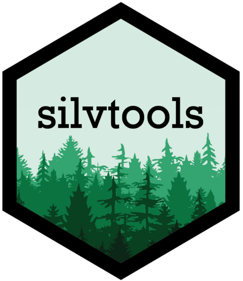

<!-- README.md is generated from README.Rmd. Please edit that file -->

# silvtools

<!-- badges: start -->

# silvtools 

<!-- badges: end -->

The goal of silvtools is to provide a reproducible workflow for
tree-level analyses of fine-scale remote sensing datasets.

The package contains functions for a wide variety of tasks including
segmentation, tree matching, competition index calculation, crown
structural metric creation with alpha shapes, and solar simulation with
rayshader

## Installation

You can install the development version of silvtools from
[GitHub](https://github.com/) with:

``` r
# install.packages("devtools")
devtools::install_github("liamirwin/silvtools")
```

You’ll still need to render `README.Rmd` regularly, to keep `README.md`
up-to-date. `devtools::build_readme()` is handy for this. You could also
use GitHub Actions to re-render `README.Rmd` every time you push. An
example workflow can be found here:
<https://github.com/r-lib/actions/tree/v1/examples>.
